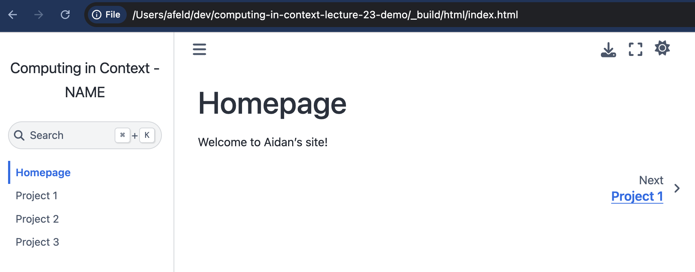

# Project 3

Complete [Lab 12](lab_12.ipynb#jupyterbook) before proceeding.

## Objectives

This project has two parts:

- [Publishing your Projects as a website](#project-site)
- [Proving or disproving a hypothesis using skills learned in this class](#data-analysis)

They can be done in either order, or in parallel.

## Project site

You don't know how to do this yet. You will need to read the documentation to figure it out.

1. **Make a homepage** in your JupyterBook.
   - Suggest making it a Markdown file, `index.md`
   - `project_3` will no longer be the `root`
   - Relevant documentation:
     - [Create your own content file](https://jupyterbook.org/en/stable/start/new-file.html)
     - [Structure the Table of Contents](https://jupyterbook.org/en/stable/structure/toc.html)
1. **Add your Project 1 and 2** as pages (`chapters`) of your site.
1. **Add the following** near the top of each Project notebook (before any Plotly code), and `Run All`. [More information.](https://plotly.com/python/renderers/)

   ```python
   import plotly.io as pio

   pio.renderers.default = "vscode+jupyterlab+notebook_connected"
   ```

[Build](lab_12.ipynb#build-the-site) and [preview](lab_12.ipynb#view-the-site-locally) as many times as you need to confirm things show up as expected.

```{tip}
You can press the up arrow on your keyboard to get to [previously-run commands](https://www.thomas-krenn.com/en/wiki/Bash_history), rather than having to re-type it each time.
```

The built site should look something like this:



You are more than welcome to customize the site as much as you like, but it's recommended that you complete the Project first.

```{caution}
Please do not include your Lab notebooks in your site, per the [Academic Integrity Policy](index.md#academic-integrity).
```

### Publish

You will be [deploying the site to Read the Docs](https://jupyterbook.org/en/stable/publish/readthedocs.html) [via GitHub](https://docs.readthedocs.io/en/stable/tutorial/index.html).

1. Add an [`environment.yml`](https://docs.conda.io/projects/conda/en/latest/user-guide/tasks/manage-environments.html#sharing-an-environment) file to specify the [conda package](https://docs.conda.io/projects/conda/en/stable/glossary.html#conda-package) dependencies for building the site.

   ```yaml
   name: computing-in-context
   channels:
     - default
     - conda-forge
   dependencies:
     - jupyter-book=1.*
     # https://github.com/sphinx-doc/sphinx/issues/10440#issuecomment-1556180835
     - sphinx>=6.2.0
   ```

1. Add a [`.readthedocs.yml`](https://docs.readthedocs.io/en/stable/config-file/index.html) file, matching [the one from this site](https://github.com/afeld/computing-in-context/blob/main/.readthedocs.yaml).
   - [Mac: "Dotfiles" (starting with a period) are hidden by default in Finder.](https://www.avast.com/c-mac-show-hidden-files)
1. Commit and push the changes.
1. Go through the [Read the Docs tutorial](https://docs.readthedocs.io/en/stable/tutorial/index.html#creating-a-read-the-docs-account).
   - Skip "Preparing your repository on GitHub" - you've already done that.
   - Stop after "Checking the first build".

## Data analysis

[General Project information](notebooks.md#projects)

You can think of this as similar to the [Project 2](project_2.md) requirements, but expanded. [Examples of Final Projects for Python for Public Policy](https://python-public-policy.afeld.me/en/columbia/final_project/examples.html) - the result of this Project will be similar.

### Process

You'll be working in [the notebook created in Lecture 23](lecture_23.ipynb#create-notebook).

1. [Find a dataset](notebooks.md#projects) that seems interesting.
   - To meet the [requirement](#analysis-requirements) that your project "not be trivial," you probably want a dataset that's large enough that you can't understand it at a glance.
     - If you're only using one dataset, you probably want it to have 500+ rows.
1. Load the data into a DataFrame.
1. Inspect the data a bit.
1. Fill out the prompt (below).
   - Work backwards: On a piece of paper / whiteboard, draw the visualization you imagine producing.
1. Use the data to answer the question.
1. If you end up answering your initial research question easily (haven't met [the requirements](#analysis-requirements)), that's fine. Ask and answer follow-up question(s).
   - Go deep, not broad.

### Prompt

Put the following in a Markdown cell in your notebook and fill it out:

<!-- https://myst-parser.readthedocs.io/en/latest/syntax/organising_content.html#inserting-other-documents-directly-into-the-current-document -->

```{include} src/project_3_prompt.md

```

:::{admonition} Raw Markdown
:class: dropdown

```{literalinclude} src/project_3_prompt.md
:language: md
```

:::

The question should be:

- Specific
- Objectively answerable through the data available
- _Just the right amount_ of ambitious ([non-trivial](#analysis-requirements))

If you want help/feedback, don't hesitate to ask on [Ed](https://courseworks2.columbia.edu/courses/207091/external_tools/37606?display=borderless) or come to [office hours](office_hours.md).

#### Tips

- Don't overthink it; getting up through filling out the prompt shouldn't take more than a few hours.
- Your question/hypothesis doesn't need to be something novel; confirming something you read / heard about is fine.
- The point of the prompt is to ensure you've dug into the data and that your project scope is reasonable. Think of it as a guide rather than something you're locked into.
- Even the question can bake in assumptions.
  - Example: "What ZIP code has the highest number of food poisoning cases?" assumes a relationship between food-borne illness and geography.
  - What assumptions does your question make?

### Analysis requirements

Your submission should:

- **Meet the [general Project requirements](notebooks.md#projects)**
- **Not be trivial** - requiring:
  - At least 40 lines of code to come to a conclusion
    - That code should be relevant to answering your question. In other words, having 40 lines of `print("hello world")` wouldn't count.
    - If you meet all the other requirements, you will likely be well over this number.
    - You can count them automatically using a tool like [tokei](https://github.com/XAMPPRocky/tokei).
  - Transforming data through [grouping](https://pandas.pydata.org/pandas-docs/stable/user_guide/groupby.html), [merging](https://pandas.pydata.org/pandas-docs/stable/user_guide/merging.html#merge), and/or [reshaping](https://pandas.pydata.org/docs/user_guide/reshaping.html) of DataFrames
  - Operations that aren't easily done in a spreadsheet.
- **Have a visualization** (chart or map) of some kind
  - [General requirements](notebooks.md#visualizations)

You won't be graded on the scientific soundness of your work. That said, please think through and note assumptions/caveats/unknowns of your approach.

## Submission

**Make sure you have [the prompt](#prompt) filled out**, including your site URL. Then, submit via Gradescope.

If you're unable to submit ([file is too large](notebooks.md#known-issues), etc.), that's ok, it's just a redundancy. You can submit a notebook / text file / etc. that just contains a link to your site.

## Rubric

- 50% [General project requirements](notebooks.md#projects)
- 40% Non-trivial
- 10% Visualization(s) meet [the requirements](notebooks.md#visualizations)
